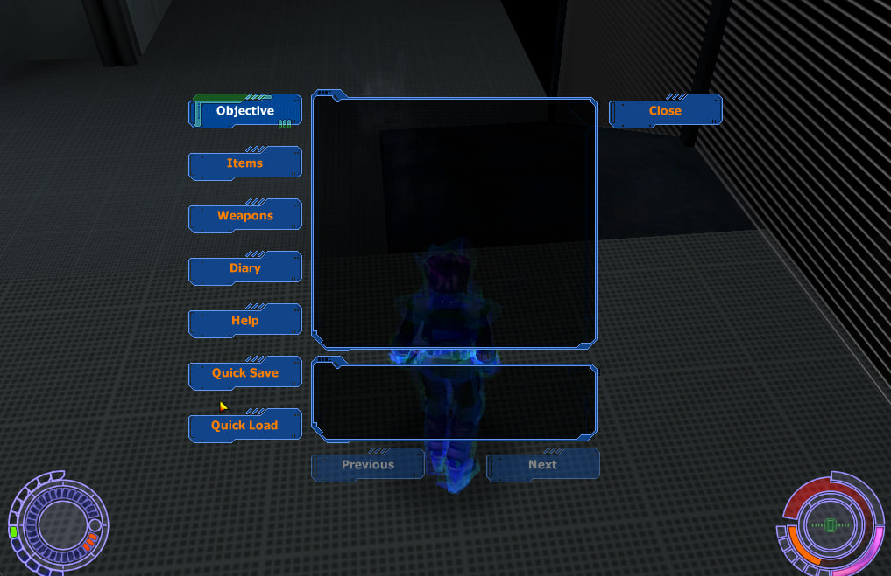

# Extensions

Extra features this fork adds on top of
[OniARM64](https://github.com/andiyar/OniARM64), the native Apple Silicon port
of Bungie's *Oni* (2001).

The port is the base; everything here is layered on top of it and keeps
upstream's behaviour wherever it can. One section per extension, ordered as
they landed. Each one covers how to use it and what it does and does not do,
with a short **For maintainers** note at the end giving the code layout and
the limits worth knowing before you change anything.

Player-facing announcements live in [CHANGELOG.md](CHANGELOG.md); the
per-commit developer detail is in [HISTORY.md](HISTORY.md).

---

## Quick save and quick load

Save and reload anywhere in a level, without walking back to a save point.

Story save points are placed at chapter boundaries by the level designer, and
that is still how campaign progress is recorded. Quick save covers the other
case: you are twenty minutes into a firefight, it is about to go badly, and
you want to keep what you have.

### Using it

**Data Pad.** Open the pad with **F1**. **Quick Save** and **Quick Load** sit
in the left column, under **Help**. Press either one and the pad closes and
the work happens — there is no confirmation step. **Quick Load** is greyed out
until a quick save exists, so it cannot do anything surprising on a fresh
install.



**Keys.** **F5** saves, **F9** loads. A fresh install's `key_config.txt` gets
both. If you already have one, add them:

```
bind fkey5 to quick_save
bind fkey9 to quick_load
```

Neither is behind the developer-access gate, so you do not need cheats on.

**Script.** Level scripts and the developer console get `quick_save` and
`quick_load`.

Quick save needs a loaded level and a player character, so pressing it from
the main menu does nothing but say **Cannot save here**.

### What a quick load puts back

The level is rebuilt from its own data at the chapter you were in — the state
its designer placed — and then your changes are applied on top:

- **You** — health, weapons, position and facing.
- **Enemies** — each one's position, facing and current hit points. A guard
  you had whittled to half health comes back at half health.
- **Bodies** — enemies you killed come back as corpses, where they fell and in
  the pose they landed in.
- **Doors** — doors you opened or unlocked come back that way. A door you
  never touched comes back as the designer left it, locked if it was locked.
- **Glass** — panes you broke stay broken.

### What it does not put back

A quick save snapshots the world, not time.

- **Scripts re-run.** Anything a script already did — a trigger you crossed, a
  door a script opened, a spawn wave — happens again on load.
- **AI starts over.** Enemies reassess from scratch and will not remember they
  were flanking you.
- **The clock resets.** The level's elapsed time starts again from zero.

This is inherent to how the reload works: the level is genuinely rebuilt, and
only the pieces listed above are carried across.

### Your saved games are not touched

Quick save writes its own file and never goes near `persist.dat`. Save points,
unlocked levels and diary pages are untouched, and a quick load cannot cost
you a real save.

### The file

One file, one slot:

```
~/Library/Application Support/OniARM64/quick_save.dat
```

A second quick save overwrites the first. If a `quick_save.dat` already exists
in the directory you launch the game from, that copy is used instead — handy
when you are running a build straight out of the repository.

Delete the file and **Quick Load** greys out again the next time you open the
pad.

### What you will see

| Message | When |
| --- | --- |
| *Game saved* | Quick save succeeded, with the game's save chime. |
| *No quick save* | Quick load found nothing, or the file was unreadable. |
| *Cannot save here* | Quick save with no level loaded or no player. |
| *Could not write quick save* | The file could not be written. |

The chime plays at full volume from the Data Pad buttons. The pad fades the
game's audio down while it is open, and both buttons wait until the pad is
gone before doing anything, so the chime is not caught in that fade.

### For maintainers

`Oni_QuickSave.c/.h` owns the file format, `Oni_GameState.c` captures and
applies, `Oni_InGameUI.c` owns the Data Pad buttons.

**Format.** A fixed header — level, save point, player record, four record
counts — followed by four variable-length runs: characters, doors, geometry
quads, corpses. Only live records are written, so the file stays proportional
to its contents rather than to the array maxima.

Every record is fixed-size and pointer-free *by construction*, because each
one has to survive `ONrLevel_Unload`. Identity is a name, an ordinal or an ID,
never an address. Two consequences worth knowing before extending it:

- Character identity is `(name, ordinal)`, not name alone. Shipped levels
  spawn the same name repeatedly on purpose — `respawn1` up to three times in
  `power`, `WH_Striker_C` four times in `EnvWarehouse` — so a name is not a
  key.
- A corpse record stores its character class as a *name*. `ONtCorpse_Data`
  holds an `ONtCharacterClass *` that dies with template memory and the corpse
  renderer dereferences it, so restoring a corpse by byte copy would be a
  use-after-free.

**The reader rejects, it does not repair.** Missing, empty, truncated, short,
wrong version, wrong swap code, and counts that would overrun the fixed arrays
all end in a clean "no quick save". The count guard is the load-bearing one: a
count read off disk indexes a fixed array.

Adding a field means bumping `ONcQuickSave_Version`; the swap code is a second
guard against a file written by a different build.

**Both Data Pad buttons defer.** Each one closes the pad and sets a pending
flag, and `Oni.c` consumes it on the same iteration once the pad is destroyed.
The deferral is not load-bearing for safety — the modal loop has the world
frozen, and every capture is a read-only walk — it exists so the save chime
plays at full volume instead of the pad's 50% cut, and so both buttons have
one shape.

**The buttons reuse controls 112/113**, Bungie's multi-page-help Previous/Next
buttons. They are present and art-complete in the binary dialog template but
have been dead since that feature was cut, and the template is game data that
cannot be edited from source — so reusing them is the only route that does not
mean building controls at runtime. They land at `217,408` and `217,468`, one
and two rows below **Help**, with the row pitch read from the tab column
itself rather than hardcoded.

**Tests** are standalone and need no framework:

```
cc -Wall -Wextra -DUUmSDL=1 \
   -IBungieFrameWork/BFW_Headers -IOniProj/OniGameSource \
   -I/opt/homebrew/include \
   tests/test_oni_quick_save.c OniProj/OniGameSource/Oni_QuickSave.c \
   -o /tmp/test_oni_quick_save
/tmp/test_oni_quick_save
```

**Known gap:** the Data Pad buttons were verified headlessly, by posting the
same window-manager message a keypress produces. That is not a mouse. Hit
testing, focus behaviour and the on-screen look of the reused art against the
partspec all still want a human at the keyboard.

---

## Combat block

Hold a key to raise a guard, and keep it up as long as you hold it.

Oni's own block is reactive and narrow. You cannot choose to guard: a block
only happens while an attack is already landing, and only if you happen to be
facing the attacker — the game checks for it within 20 degrees. Turn away and
the guard quietly does not exist. This adds one you control, and it does not
care which way you are facing.

### Using it

Hold **Z**. The guard goes up and stays up while you hold it; let go and you
drop back to standing, or back to crouching if you were crouching.

**Crouch-blocking** works: hold crouch first, then **Z**, and you block from a
crouch. Holding **Z** first and crouching second does nothing — the guard
cannot change your stance while it is up.

**Rebinding.** A fresh install's `key_config.txt` gets the bind. If you already
have one, add:

```
bind z to block
```

If your config has no block bind at all and `z` is free, the game binds it for
you at startup and says so in the log. If `z` is already taken it leaves your
binding alone and tells you block has no key, so nothing you set is ever
silently reassigned.

### What it covers

- **Every angle.** Attacks from behind are covered the same as attacks from the
  front. This is the whole point of the feature.
- **Every height.** High and low attacks are both stopped. The game's own
  reactive block can only stop whichever height the animation it picks is
  authored for.

### What it does not do

- **It does not interrupt you.** The guard only comes up from a neutral stance
  — standing, or crouching. If you are mid-punch, mid-kick, mid-jump or
  mid-landing, you finish that first, and the guard comes up the moment it
  ends. Holding the key through a punch does not cancel the punch.
- **You cannot move while guarding.** No walking, no running, no jumping, no
  switching weapons, no stance changes. Let go of the key for any of those.
  There is no block-and-move animation in the game's data.
- **Attacks flagged unblockable are stopped too.** The reactive block skips
  those entirely; the held guard does not. This is deliberate — the guard is
  something you choose to hold, so it is the one defence that answers
  everything.
- **Super moves are stopped in full.** Against the game's own block an attack
  flagged as a super move penetrates even when the block succeeds, landing half
  its base damage and half its knockback. The held guard stops it outright.
- **Carrying a two-handed weapon means no guard at all**, key held or not. This
  is the game's existing rule for the player, and it is unchanged.
- **It is player-only.** Enemies cannot use it and are otherwise unaffected by
  it, except that they cannot throw you while it is up.

### For maintainers

Three files carry the feature. `Oni_Character.c` owns the predicates,
the any-angle answer in `ONrCharacter_CouldBlock` and what a held guard stops in
`HandleAttackMask`; `Oni_GameState.c` owns the held state and `HandleBlock`;
`Oni_AI2_Melee.c` owns the AI's refusal to pick a throw it cannot land.

**Two predicates, two questions.** `ONrCharacter_IsBlocking` means "the guard is
up" — the key is held and the character is not in hit stun — and it is what the
damage path asks before deciding an attack is covered. `ONrCharacter_IsGuarding`
adds "and neither staggered nor dizzy" and is what `HandleBlock` and the
movement code ask; a staggered character must still be shoved around, so the
guard cannot own their movement while a stagger animation is playing.

**The hook already existed and was dead.** `LIc_Bit_Block` was defined, was
registered against the action name `"block"`, and was read by zero lines of
gameplay code — so `bind z to block` parsed and did nothing before this. Only a
bound physical key can set that bit, which is what makes the feature
player-only by construction rather than by convention.

**State is `ONtActiveCharacter.blocking`**, recomputed from input every tick in
`ONrCharacter_HandleHeartbeatInput`, not a character flag: `ONtCharacterFlags`
is full — all 32 bits named — and it needs no lifecycle handling, since the
active-character struct is cleared wholesale on activation, deactivation and
level begin. It is written before that function's two early exits so releasing
the key during an animation lock is still seen.

**`HandleBlock` sits between `HandleStun` and `HandleLeaveStun`**, and claims
only from a neutral stance. That placement does two jobs at once: claiming only
from a neutral stance is what stops the guard interrupting your own attack, and
sitting above `HandleLeaveStun` is what stops `blockStun` expiring from kicking
a held guard back to standing, since that function's `Block` case forces Stand
or Crouch. No edit to `HandleLeaveStun` was needed.

**`CouldBlock` answers a held block early**, reporting both height flags true
and skipping the facing test, and leaves the authored path below it untouched.
The `IsDefensive` test is skipped for an actively blocking player, and that is
load-bearing: `ONrCharacter_IsDefensive` computes `toIsCrouchOrStand` from
`fromState` instead of `toState`, so once a block is held the animation's own
states stop matching the crouch/stand list and defensiveness goes false for the
whole hold. **That typo is deliberately left alone.** Correcting it would test
`Blocking1`/`Crouch_Blocking1`, which are not in that list either, and would
break the existing reactive block and AI blocking with it. It needs the
`Blocking` states added to the list first, which is its own change.

**A held guard also answers the two attacks that beat a block.**
`HandleAttackMask` skips the whole block test for anything flagged
`ONcAttackFlag_Unblockable`, and lets a `ONcAttackFlag_SpecialMove` attack
through a successful block for half its base damage. Both gates now yield to
`ONrCharacter_IsBlocking`, so an actively blocking player is the one defender
the game cannot route around. The authored rules are untouched for everyone
else: an AI defender still cannot block an unblockable, and a super move still
penetrates an AI's block. The two-handed-weapon refusal sits above both in
`CouldBlock` and still applies, so a held guard behind a rifle is still no
guard.

**A held guard owns the character's ground movement.** The block animation is a
one-shot reaction with authored root motion, and `KONCOMblock1_end` and
`KONCOMblock2_end` are typed `ONcAnimType_Stand`, so `HandleBlock` reads the
frame they begin as a neutral stance and re-raises the guard. Replaying that
reaction on a loop applied its step-back every cycle — the character drifted
backwards at about 2 units/sec while the key was held. `ONrGameState_DoCharacterFrame`
now takes no animation movement at all while `ONrCharacter_IsGuarding` is true:
the frame's movement is the zero vector plus gravity, and knockback is added
past that point so a blocked hit still lands as a shove. Airborne characters
resolve their velocity in an earlier branch and a carried character takes a
separate arm, so neither is affected. The re-raise loop itself is unchanged —
the guard still cycles its two animation variants while held, it just no longer
moves you.

**Throws are refused at three sites, all reading the same predicate.**
`AI2iMelee_TargetIsThrowable` is the primary gate — the AI consults it both when
weighting techniques and again at execution, so one edit stops the AI choosing
a throw it cannot land, which is what makes it look like a decision rather than
a failure. `AttemptThrow` carries the same refusal next to the existing
`ONrCharacter_IsKnockdownResistant` check. The third is the AI commit point in
`RemapAnimationHook`, and it is not redundant: the executor sets the throw
override and still has to land a punch, and the atomic-animation delay can hold
that override for many frames, so there is a real window in which you raise the
guard after the AI has committed. Gating inside `ONrPerformSpecificThrow`
instead was considered and rejected — it returns `void` and both callers infer
success from `specificThrow.srcThrow`.

**The weighting path has to agree with the gate, which is why
`AI2iMelee_WeightTechnique` is part of this change.** Refusing a throw only
reads as a decision if the technique leaves the selection pool; otherwise the
AI picks it, aborts at execution, blacklists it and picks it again. That
function already zeroed the weight on the branches that refuse a throw for
being from the wrong side or for having no active target, but the two below
them — no throw animation from the target's current state, and an unthrowable
target — labelled the technique and fell through with full weight. With this
gate in place those two fire constantly, so they now zero as well. **This
changes which technique an AI picks, so the level-sweep baselines move on the
settle phase.** The shift is on level 19, it reproduces from that one commit
alone, and it is deterministic across runs; the session entry in
[HISTORY.md](HISTORY.md) has the bisect.

**`ONI_BLOCK_TRACE`** (set to anything but `0`) turns on a `[block]` trace in
`startup.txt`: the guard raising and the state it raised from, the guard
dropping with whether the key was still held when it did, the angle of every
hit a held guard absorbed, and every refused throw with its site. It exists
because none of this is reachable from the sweep harness — `-sweep` never runs
the main loop and no key is ever pressed — so these lines are the only way to
see the feature's internals without a debugger.

**Known gap:** the feature is build-verified and the key binding is verified
headlessly, but every behaviour in the list above needs a human at the
keyboard. See the session entry in [HISTORY.md](HISTORY.md) for exactly what
was and was not checked.
